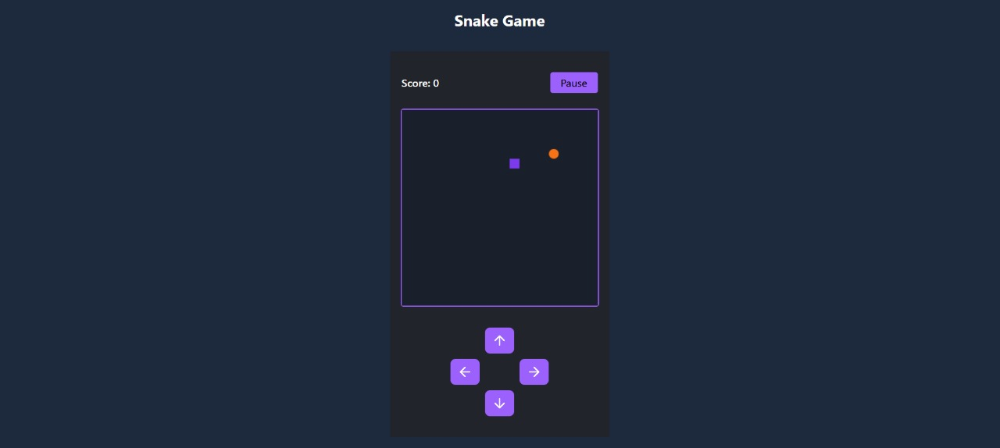

# 🐍 Snake Game — React + TypeScript + Tailwind

A modern Snake Game built using **React**, **TypeScript**, and **Tailwind CSS**. This project was created for learning and fun, showcasing real-time game logic, dynamic UI rendering, and keyboard event handling — all within a React application.

## 🚀 Features

- Real-time movement and keyboard controls
- Classic snake growth and collision mechanics
- Responsive grid-based game board
- Score tracking with increasing difficulty (speed)
- Pause and reset functionality
- Styled using Tailwind CSS with custom theme colors
- Clean and maintainable TypeScript code

## 🛠 Tech Stack

- ⚛️ React
- ⛑ TypeScript
- 🎨 Tailwind CSS

## 🧑‍💻 Getting Started

### Prerequisites

- Node.js (v18 or higher recommended)
- npm or yarn